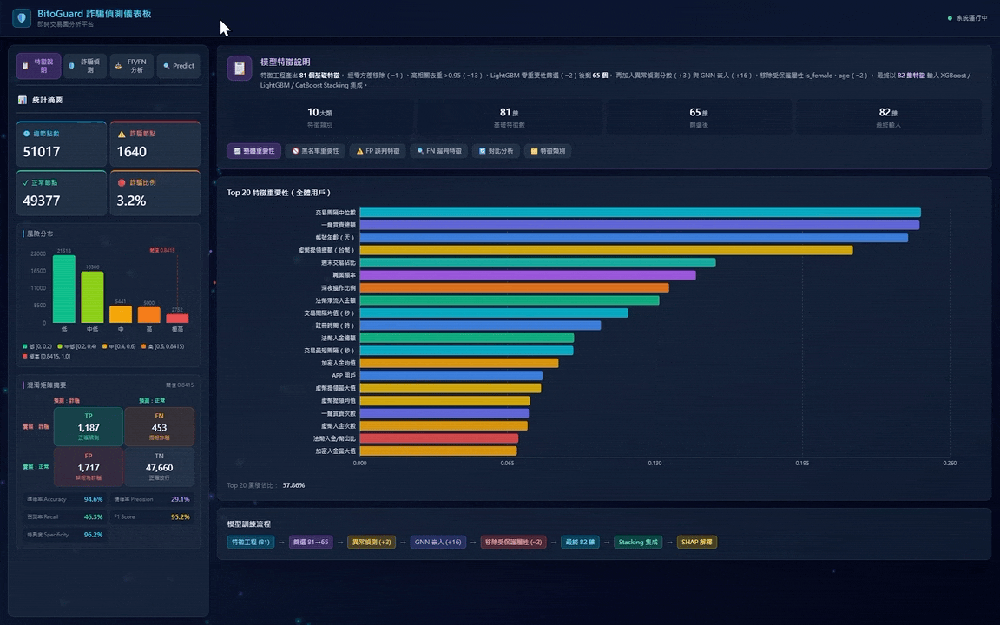
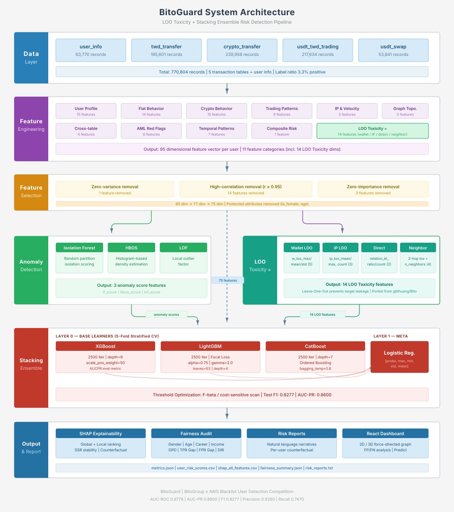
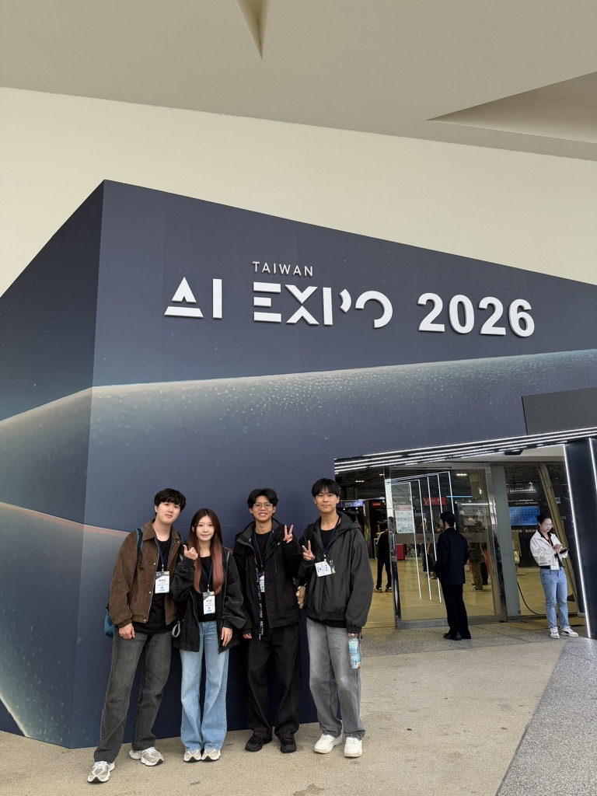
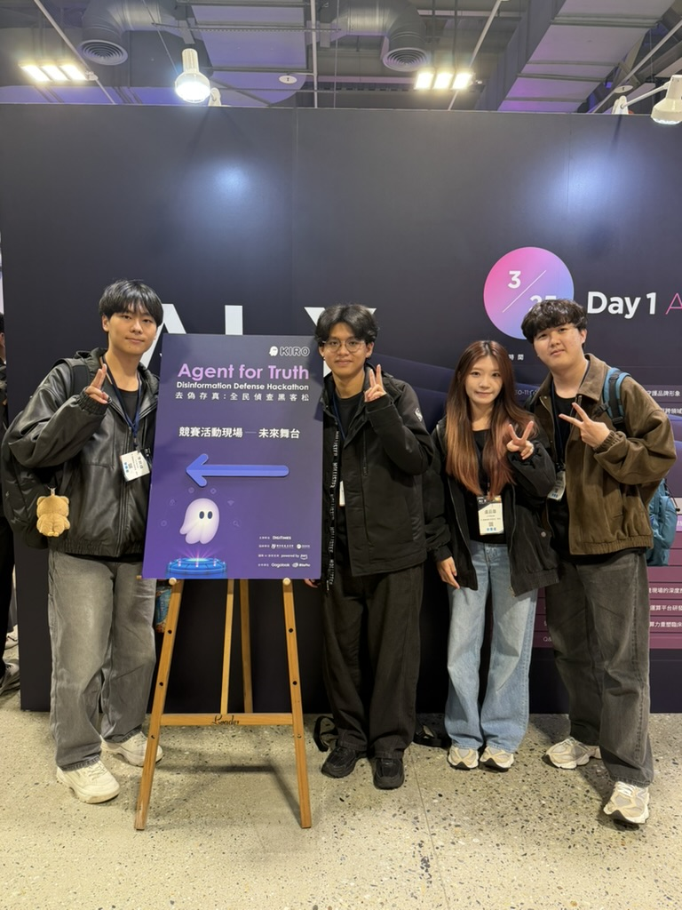
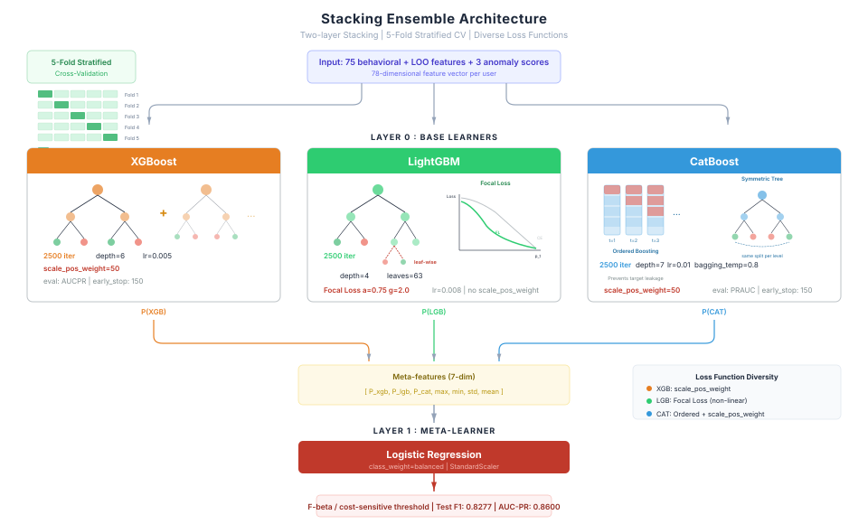

<h1 align="center">BitoGuard：智慧合規風險雷達</h1>

<p align="center">
  <strong>AI 驅動的加密貨幣黑名單偵測系統 — 基於 GNN + Stacking Ensemble 混合模型</strong>
</p>

<p align="center">
  <a href="https://timwei0801.github.io/Bio_AWS_Workshop/"></a>
  <a href="https://www.python.org/downloads/"></a>
  <a href="https://pytorch.org/"></a>
  <a href="https://reactjs.org/"></a>
  <a href="https://www.typescriptlang.org/"></a>
  
</p>

---

## Demo

<p align="center">
  
</p>

> 互動式 3D 風險儀表板 — 即時視覺化交易網路圖譜、節點風險分數與 SHAP 可解釋性分析

---

## Overview

<table>
<tr>
<td width="60%">

加密貨幣交易所面臨嚴重的**人頭戶（黑名單用戶）**問題——這些帳戶被用於洗錢、詐騙資金流轉等非法活動。

本專案針對 **77 萬筆交易紀錄**，以雙軌策略建構端到端風險偵測系統：

- **異質圖神經網路**：HeteroSAGE + GAT 捕捉風險傳播路徑
- **三模型 Stacking Ensemble**：XGBoost + LightGBM (Focal Loss) + CatBoost
- **SHAP 全方位可解釋性**：逐案風險歸因 + 反事實建議
- **公平性審計**：性別、年齡、職業、收入四維度偏差檢測

</td>
<td width="40%">



</td>
</tr>
</table>

---

## 活動紀錄

本專案參加 **BitoGroup × AWS 黑名單用戶偵測競賽**，並於 **Taiwan AI EXPO 2026** 展示成果。

<table>
<tr>
<td width="50%">
<p align="center">
  
</p>
<p align="center"><sub><b>Taiwan AI EXPO 2026</b> — 團隊於會場展示 BitoGuard 系統</sub></p>
</td>
<td width="50%">
<p align="center">
  
</p>
<p align="center"><sub><b>Agent for Truth — Disinformation Defense Hackathon</b> — 競賽活動現場</sub></p>
</td>
</tr>
</table>

---

## Key Features

| | | | |
|:---:|:---:|:---:|:---:|
| **81 維特徵工程** | **異質圖神經網路** | **三模型 Stacking** | **SHAP 可解釋性** |
| 10 大類特徵，65 維篩選 | HeteroSAGE + GAT | XGB + LGB + CAT | Global + Local + 反事實 |

| | | | |
|:---:|:---:|:---:|:---:|
| **公平性審計** | **互動式 3D 儀表板** | **半監督學習** | **異常偵測** |
| 四維度偏差檢測 | React + Three.js | Pseudo-Labeling | IF / HBOS / LOF |

---

## Performance

<table>
<tr>
<td width="25%" align="center">
<h3>0.861</h3>
<sub>AUC-ROC</sub>
</td>
<td width="25%" align="center">
<h3>0.307</h3>
<sub>AUC-PR</sub>
</td>
<td width="25%" align="center">
<h3>0.463</h3>
<sub>Recall</sub>
</td>
<td width="25%" align="center">
<h3>0.357</h3>
<sub>F1-Score</sub>
</td>
</tr>
</table>

---

## System Architecture

<p align="center">
  
</p>

---

## 完整 Pipeline

### Step 1：資料載入與驗證

從 5 張交易表 + 用戶資訊表載入資料，執行嚴格的欄位型態轉換，缺失值統計報告，並驗證黑名單比例一致性。

### Step 2：特徵工程（81 維 → 65 維）

自 5 張原始交易表中萃取 **81 維特徵**，分為 **10 大類別**：

| # | 特徵類別 | 數量 | 代表特徵 | 偵測意圖 |
|---|----------|------|----------|----------|
| 1 | **用戶人口特徵** | 15 | `kyc_speed_sec`, `account_age_days`, `reg_hour` | KYC 異常、深夜註冊 |
| 2 | **法幣交易行為** | 14 | `twd_dep_sum`, `twd_net_flow`, `twd_smurf_flag` | 淨流出、Smurfing |
| 3 | **虛幣交易行為** | 15 | `crypto_wit_sum`, `crypto_wallet_hash_nunique` | 多錢包分散提領 |
| 4 | **掛單/一鍵買賣** | 9 | `trading_buy_ratio`, `swap_sum` | 單向購買、市價單洗量 |
| 5 | **IP & 資金流速** | 5 | `ip_unique_count`, `ip_night_ratio`, `fund_stay_sec` | 多 IP 切換、快進快出 |
| 6 | **交易圖拓撲** | 5 | `pagerank_score`, `connected_component_size` | 資金樞紐、集團聚集 |
| 7 | **跨表衍生** | 4 | `total_tx_count`, `weekend_tx_ratio` | 近期活動加速 |
| 8 | **AML 紅旗指標** | 6 | `twd_to_crypto_out_ratio`, `same_day_in_out_count` | 法幣入→幣出漏斗 |
| 9 | **時序模式** | 7 | `tx_interval_mean`, `amount_p90_p10_ratio` | 規律性操作、爆發交易 |
| 10 | **複合風險分數** | 1 | `composite_risk_score` | 多維度加權綜合 |

<details>
<summary><b>特徵篩選流程（81 → 65 維）</b></summary>

1. **零方差移除**：`has_kyc_level2`（1 個）
2. **高相關性移除**（閾值 ≥ 0.95）：13 個高度共線性特徵
3. **零重要性移除**：`betweenness_centrality`, `velocity_ratio_7d_vs_30d`（2 個）

> 異常偵測分數（3 維）與 GNN 嵌入（16 維）於後續步驟加入，再經公平性審計移除 `is_female`、`age`，最終模型輸入為 **82 維**。

</details>

### Step 3：異常偵測特徵

| 演算法 | 輸出特徵 | 原理 |
|--------|----------|------|
| **Isolation Forest** | `if_score` | 隨機切割隔離異常點，路徑越短越異常 |
| **HBOS** | `hbos_score` | 直方圖密度估計，低密度區域為異常 |
| **LOF** | `lof_score` | 局部離群因子，偏離鄰域密度越大越異常 |

### Step 4：圖神經網路 (GNN)

利用鏈上錢包地址，建構**異質圖 (Heterogeneous Graph)**，捕捉傳統表格特徵無法表達的**風險傳播關係**。

<p align="center">
  
</p>

### Step 5：Stacking Ensemble 集成學習

採用兩層 Stacking 架構，三個 Base Learner **各自使用不同損失函數**以最大化模型多樣性：

<p align="center">
  
</p>

<details>
<summary><b>不平衡處理策略</b></summary>

- **Focal Loss**（LightGBM）：α=0.75, γ=2.0，自動增加邊界樣本的損失權重
- **scale_pos_weight=50**（XGBoost / CatBoost）：正負比例加權
- **Borderline-SMOTE**（可選）：僅對邊界少數類過採樣 30%

</details>

### Step 6：SHAP 可解釋性分析

**Global 解釋** — Top 10 特徵重要性：

| 排名 | 特徵 | 中文 | SHAP 佔比 | 累積 |
|------|------|------|-----------|------|
| 1 | `tx_interval_median` | 交易間隔中位數 | 5.61% | 5.61% |
| 2 | `swap_sum` | 一鍵買賣總額 | 5.60% | 11.21% |
| 3 | `account_age_days` | 帳號年齡 | 5.48% | 16.69% |
| 4 | `crypto_wit_sum` | 虛幣提領總額 | 4.93% | 21.63% |
| 5 | `weekend_tx_ratio` | 週末交易佔比 | 3.56% | 25.19% |
| 6 | `career_freq` | 職業頻率 | 3.36% | 28.55% |
| 7 | `ip_night_ratio` | 深夜操作比例 | 3.09% | 31.64% |
| 8 | `twd_net_flow` | 法幣淨流入金額 | 3.00% | 34.64% |
| 9 | `tx_interval_mean` | 交易間隔均值 | 2.68% | 37.32% |
| 10 | `reg_hour` | 註冊時段 | 2.41% | 39.73% |

> GNN 嵌入特徵合計貢獻約 **12.8%**，異常偵測分數合計貢獻約 **3.0%**。

<details>
<summary><b>Local 解釋 + 反事實分析 + SSR 穩定性</b></summary>

**Local 解釋**：每位用戶的 SHAP Waterfall Plot — base value → 各特徵推/拉 → 最終預測

**反事實分析（Counterfactual）**：自動建議哪些特徵調整可降低風險
- 範例：「若將 KYC 完成速度從 54,799 秒調整至 0，風險分數可降低 0.014」

**SSR 穩定性驗證**：以 ε = 0.05 ~ 0.20 擾動特徵值，驗證 SHAP 排名的穩健性

</details>

### Step 7：公平性審計

| 受保護屬性 | 檢測結果 | DPD | TPR Gap | FPR Gap | DIR |
|-----------|---------|-----|---------|---------|-----|
| **性別 (Gender)** | **FAIL** | 0.078 | 0.185 | 0.054 | 0.281 |
| **年齡 (Age)** | **FAIL** | 0.079 | 0.094 | 0.067 | 0.239 |
| **職業風險 (Career)** | **PASS** | 0.009 | 0.028 | 0.008 | 0.849 |
| **收入來源 (Income)** | **FAIL** | 0.022 | 0.088 | 0.017 | 0.587 |

<details>
<summary><b>關鍵發現與建議</b></summary>

- 女性用戶 TPR 54.7% vs 男性 36.2%（女性被標記率為男性 1.51 倍）
- 30-50 歲群組 TPR 49.7% 顯著高於其他年齡段
- **建議**：移除 `is_female` + `age`（無反洗錢業務正當性），保留 `is_high_risk_career` + `is_high_risk_income`（有法規依據）

</details>

---

## 互動式風險儀表板

使用 React + TypeScript + Vite 建構，支援三種檢視模式：

| 模式 | 功能 |
|------|------|
| **Fraud Mode** | 2D/3D 力導向交易網路圖譜、統計 KPI、高風險用戶清單、節點 SHAP 分析 |
| **FP/FN Mode** | 誤判案例分析 + SHAP Waterfall 圖，解釋模型判斷錯誤原因 |
| **Predict Mode** | 12,753 筆未標記用戶的預測風險分數 + Top SHAP 特徵貢獻 |

---

## 風險報告範例

```
╔══════════════════════════════════════════╗
  用戶風險報告  |  User ID: 928967
╚══════════════════════════════════════════╝

  風險分數   : 0.9874
  風險等級   : 極高風險
  建議行動   : 建議立即凍結帳戶並啟動人工調查

  ── 主要風險因子（SHAP）──
  1. 一鍵買賣總額         =  0.950  ▲ 0.7949
  2. 交易間隔最小值        =  0.081  ▲ 0.3702
  3. 交易間隔中位數        = -0.017  ▲ 0.3115
  4. 法幣提領最大值        =  0.943  ▲ 0.2901
  5. 帳號年齡（天）        = -0.745  ▲ 0.2023

  ── 可改善建議（反事實）──
  • 若將「KYC 完成速度」從 3,031 秒調整至 0，風險分數可降低 0.015
  • 若將「法幣提領比率」從 10.0 調整至 0，風險分數可降低 0.012
```

---

## 技術棧

| 層級 | 技術 |
|------|------|
| **機器學習** | XGBoost, CatBoost, LightGBM (Focal Loss), Scikit-learn |
| **深度學習** | PyTorch, PyTorch Geometric (Heterogeneous GNN) |
| **不平衡處理** | Borderline-SMOTE, scale_pos_weight, Focal Loss |
| **異常偵測** | Isolation Forest, HBOS, LOF |
| **可解釋性** | SHAP (TreeExplainer), SSR 穩定性, 反事實分析 |
| **公平性** | Demographic Parity, Equalized Odds, Disparate Impact |
| **前端框架** | React 18 + TypeScript + Vite 5 |
| **視覺化** | react-force-graph-2d/3d, Three.js, Recharts |
| **樣式** | Tailwind CSS 3 |

---

## Quick Start

### 模型訓練

```bash
# 安裝 Python 依賴
pip install xgboost catboost lightgbm scikit-learn shap torch torch_geometric imbalanced-learn pyod

# 執行完整 Pipeline（12 步驟全自動）
cd Wei_model/model
python main.py --data_dir ../../adjust_data/train --output ../output

# 跳過 GNN（無 GPU 時）
python main.py --data_dir ../../adjust_data/train --output ../output --skip_gnn
```

### 前端儀表板

```bash
cd frontend
npm install
npm run dev        # 開發模式（http://localhost:5173）
npm run build      # 生產環境建置
```

---

## 專案結構

<details>
<summary><b>展開完整目錄</b></summary>

```
Bio_AWS_Workshop/
├── Wei_model/                          # 核心 ML Pipeline
│   ├── model/
│   │   ├── main.py                    # 主訓練流程入口（12 步驟）
│   │   ├── Feature_engineering.py     # 特徵工程（10 大類 81 維特徵）
│   │   ├── feature_selection.py       # 特徵篩選（81 → 65）
│   │   ├── anomaly_detection.py       # 無監督異常偵測（IF / HBOS / LOF）
│   │   ├── Gnn_model.py              # 異質圖神經網路（HeteroSAGE + GAT）
│   │   ├── ensemble.py               # Stacking Ensemble（XGB + LGB + CAT）
│   │   ├── shap_explainer.py         # SHAP 可解釋性 + SSR + 反事實
│   │   ├── fairness_audit.py         # 四維度公平性審計
│   │   └── pseudo_labeling.py        # 半監督 Pseudo-Labeling
│   └── output/                        # 模型輸出結果
│
├── Yu_model/                          # 資金追溯模型
│   └── trace_back_model/             # 詐騙資金鏈追蹤
│
├── frontend/                           # React 互動式儀表板
│   ├── src/
│   │   ├── components/               # UI 元件
│   │   ├── utils/                    # 資料處理與圖譜邏輯
│   │   └── types/                    # TypeScript 型別
│   └── output/                        # 前端讀取的 CSV 資料
│
├── assets/                            # 架構圖與媒體素材
└── docs/                              # 文件
```

</details>

---

<p align="center">
  <a href="https://github.com/timwei0801/Bio_AWS_Workshop">
    
  </a>
  <a href="https://github.com/timwei0801/Bio_AWS_Workshop/fork">
    
  </a>
</p>

<p align="center">
  <sub>BitoGuard — AI-Powered AML Risk Detection for Cryptocurrency Exchanges</sub>
</p>
